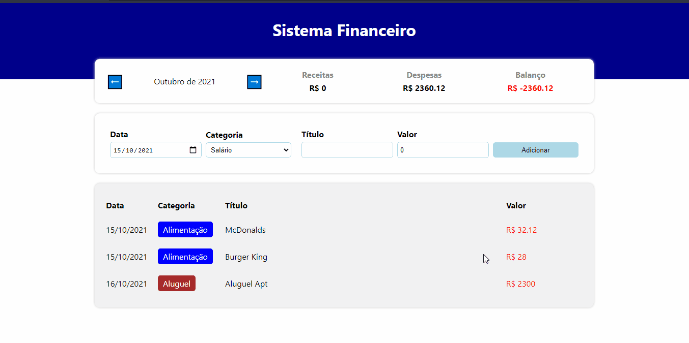

# Sistema Financeiro
<h1>Sobre</h1>

Site construido para poder ter controle das finanças pessoais.

 
 <h1>Tecnologias usadas</h1>
 <ul>
 <li>React</li>
 <li>Typescript</li>
</ul>
# Getting Started with Create React App

## Available Scripts

In the project directory, you can run:

### `npm start`

Runs the app in the development mode.\
Open [http://localhost:3000](http://localhost:3000) to view it in the browser.

The page will reload if you make edits.\
You will also see any lint errors in the console.

### `npm test`

Launches the test runner in the interactive watch mode.\
See the section about [running tests](https://facebook.github.io/create-react-app/docs/running-tests) for more information.

### `npm run build`

Builds the app for production to the `build` folder.\
It correctly bundles React in production mode and optimizes the build for the best performance.
